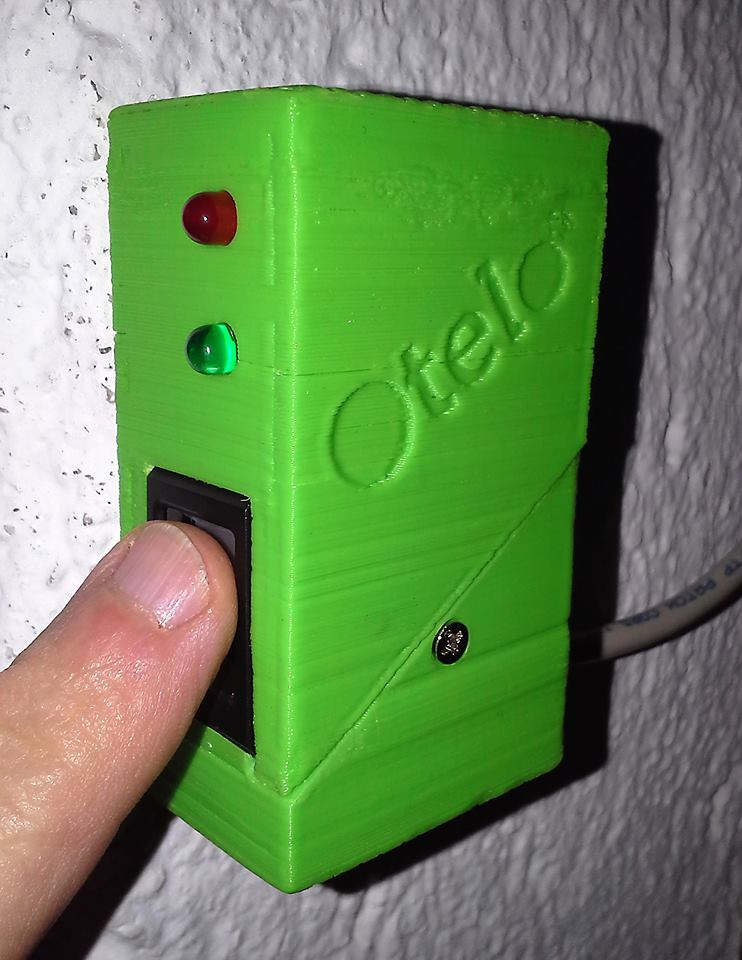
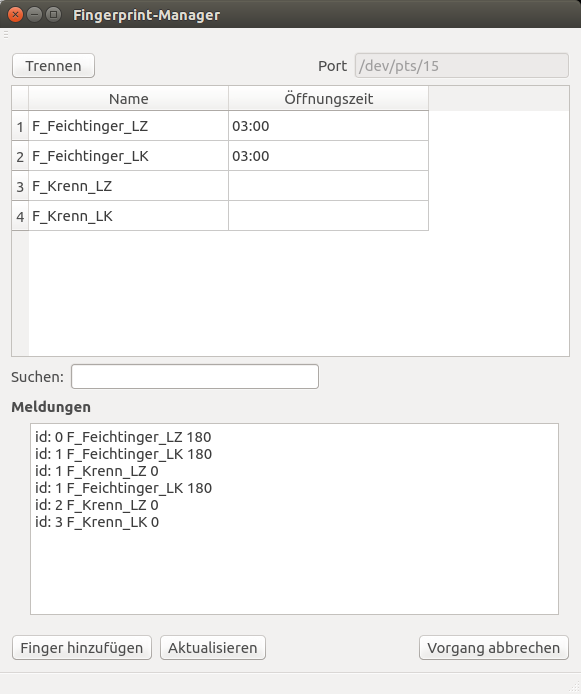

# Fingerprint Doorlock
## Overview
A simple electronic doorlock using a fingerprint sensor. 



This project uses a ZFM-20 series fingerprint sensor to implement access controll (to a building or room) using an electrical doorlock (e.g. magnetic door buzzer).

All fingerprints can be managed by a simple GUI called Fingerprint-Manager or simply over a serial terminal.



## Features
* easy access without a key, card or code (cannot be lost or forgotten)
* up to 1000 fingers can be enrolled
* whole day access option (keep the door open during events etc.)
* easy administration using the Fingerprint-Manager
* logfiles about every access (optional)

## Bill of materials
* EVK1101 Eval-Board from Atmel (a different board with an AVR32 controller might work as well)
* a ZFM-20 series fingerprint sensor e.g.
[from ebay](http://www.ebay.at/itm/Optical-Finger-print-Reader-Fingerprint-Sensor-Module-for-Arduino-Locks-/121298397934?pt=UK_BOI_Industrial_Automation_Control_ET&hash=item1c3df2aaee)
* magnetic door buzzer (I took this one [from Reichelt](http://www.reichelt.de/T-R-FFNER-1B/3/index.html?&ACTION=3&LA=446&ARTICLE=58353&artnr=T%C3%9CR%C3%96FFNER+1B&SEARCH=T%C3%83%C2%BCr%C3%83%C2%B6ffner+1B))
* power supply 9VDC, 1.5A (e.g. [from Reichelt](http://www.reichelt.de/Festspannungsnetzteile/SNT-2250-9V/3/index.html?&ACTION=3&LA=2&ARTICLE=111183&GROUPID=4946&artnr=SNT+2250+9V))
* a SD-card for the EVK1101 (capacity does not matter)
* a distribution box for the controller board
* some installation material (cables, cable channel, screws ...)
* some electronic parts from the junk box (transistor, diode, resistor, veroboard,...)

optional:

* a DCF77 receiver module (for logfiles)
* a weather-proof button (for whole day access)

## System Components
### Fingerprintsensor
The ZFM sensor is placed in a custom housing which can easily be produced using an 3D printer (and a little bit of manual work). The housing also includes a red and a green LED and optionally a button for whole day access (see below).

The sensor should be placed on the outside next to the door and is connected to the controller board with a 7-pole cable (you can use a piece of ethernet cable for this).

### Controller Board
The controller consists of the EVK1101 and some additional electronics:

* a little PWM step down circuit (transistor + diode) to drive the buzzer
* connectors for fingerprintsensor and buzzer
* a USB to serial converter

Of course the controller board needs to be placed **behind** the door in a closed housing (you can use an distribution box for this).

The 9V power supply is directly connected to the EVK1101. Be carefull to choose a power supply that privides enough current for the buzzer. This might also be temperature dependent so better measure the buzzer current at 9V and choose a bigger power supply to be on the save side. 1.5A fits for my buzzer.

### Magnetic Door Buzzer
The buzzer only releases the falling latch, so the lock bar always has to be pulled back.

The buzzer might get warm when it is activated for a longer period of time (especially when using the whole day access). The firmware tries to reduce the power dissipation of the buzzer by reducing the holding current to 50% of starting current. Be shure that these settings work for your buzzer. (The buzzer has to open savely but must not get too hot.)

The buzzer is driven by the controller board. Ensure that the connecting cable is not accessible from the outside. If someone gets access to this cable he could easily open the door!

### PC
The normal operation (entering the door) is managed with with the above components only. But for enrolling new fingers, deleting fingers or to change settings a PC is necessary. You can either use a simple serial terminal software (e.g. cutecom) or you can use the Fingerprint-Manager.

## Netlist
There is no explicit schematic for the whole circuit but there is kind of a netlist ("netlist.ods") so you know which cable to connect to which pin. There are some necessary modifications on the EVK1101, don't forget about them! 

## Software
### preparing the AVR32 toolchain
You need a bunch of software to compile the firmware for the EVK1101 and load it on the controller. This is called the toolchain. I will describe how to install the toolchain for Linux (in my case Ubuntu 14.04), if you are using windows it might be enough to install the AVR32-Studio, if you like to use a Mac, go somewhere else!

Create a folder on your disk for the toolchain anywhere you want, I will call it '~/AVR32_toolchain/'.

First of all we need the compiler, so go to the [Atmel-Website](http://www.atmel.com/tools/ATMELAVRTOOLCHAINFORLINUX.aspx) and download the "Atmel AVR 32-bit Toolchain 3.4.2 - Linux 64-bit" if your OS is 64-Bit. Unpack it into '~/AVR32_toolchain/'. The folder should be called "avr32-gnu-toolchain-linux_x86_64/".

Next we need the header files, so go back and download the "Atmel AVR 8-bit and 32-bit Toolchain (3.4.2) 6.1.3.1475 - Header Files". Unpack it into '~/AVR32_toolchain/' and remove the version from the folder name so the folder is called "atmel-headers/".

We also need the so called software framework so go [here](http://www.atmel.com/tools/avrsoftwareframework.aspx?tab=overview), download an unpack to '~/AVR32_toolchain/' and remove the version so the folder is called "asf/".

We are nearly finished, the last thing we need as a little programm to download the firmware to the controller, this is called dfu-programmer. Download from [Github](https://github.com/dfu-programmer/dfu-programmer), unpack in '~/AVR32_toolchain/' and rename the folder to "dfu-programmer/".

We need to compile this one so open a terminal in the folder and enter:

```
./bootstrap.sh
./configure
make
```
dfu-programmer needs access to the USB port, to enable this you have to copy the file "avr32_dfu.rules" to "/etc/udev/rules.d/". Also you have to join the group "plugdev":
`sudo usermod -aG plugdev username`  (replace 'username' by your username)

### build the firmware
To build the firmware you first have to tell the makefile where to find the toolchain, so open the makefile and edit the `TOOLCHAIN` makro (line 20) to your toolchain path.

Then call `make` to build the firmware.

Annoyingly Atmel seams to change the structure of their software framework a little bit in each revision so it might be possible that you need to change the makefile to get the firmware to build without errors.

To download the firmware you have to connect the USB-cable to the EVK1101 and turn it on. Then you have to switch the controller into bootloader mode. To do so, hold the joystick button on the EVK1101 pushed down and then press the reset button. (Now you should see a device typically called /dev/ttyACM0 in your Linux filesystem.)

To download the firmware finally call `make flash`.

Now you can connect a serial cable to the controller (baudrate 115200) and open a serial terminal (e.g. cutecom). When you press the reset button you should see a message from the firmware.

### build the Fingerprint-Manager
The Fingerprint-Manager is a simple GUI written in Qt-5 that allows you to easily enroll and manage fingerprints. To build the Fingerprint-Manager you need to install Qt-Creator.

`sudo apt-get install qt-creator`

You also need the serial port module for Qt-5

`sudo apt-get install libqt5serialport5-dev`

Now you can simply open the Qt project (Fingerprint-Manager.pro) with Qt-Creator and build it.


